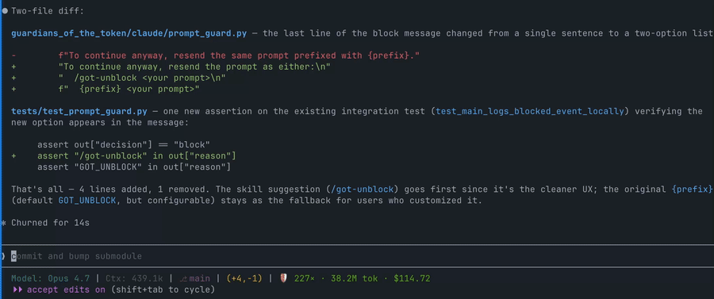

# GOT

[](https://pypi.org/project/guardians-of-the-token/)
[](https://pypi.org/project/guardians-of-the-token/)
[](LICENSE)
[](https://github.com/tonylee2016/guardians_of_the_token/stargazers)
[](https://github.com/tonylee2016/guardians_of_the_token/actions/workflows/ci.yml)


**Guardians of the Token** is a safety layer for agentic coding sessions. It helps Claude Code, Codex, and other LLM clients avoid accidental context explosions from huge files, oversized web fetches, and noisy tool output.

LLM agents are powerful because they can read, run, fetch, and reason. GOT keeps that power controlled.



## Why GOT

Agentic coding tools can burn through context in one bad move:

- reading a giant log or transcript into chat
- dumping command output that should have gone to a file
- fetching a large page directly into model context
- carrying stale session history until compaction degrades continuity

GOT watches the risky paths and turns them into a clear pause:

```text
🛡️ Guardians of the Token blocked this command.
Target: /tmp/guardians_test_compact
Estimate: ~200,000 tokens (50% of the 400,000-token window)
Current context: ~0 tokens (0%)
Next options:
- Inspect the beginning
- Inspect the end
- Search for a term
- Summarize a bounded section
- Bypass once for the full file
```

The goal is simple: prevent accidental context damage while keeping the agent moving.

## What It Guards

| Client | Guarded paths |
| --- | --- |
| Claude Code | `Read`, `Bash`, `WebFetch`, oversized tool output, **off-topic prompts in large sessions** |
| Codex | risky `Bash` file dumps, URL fetches, oversized Bash output |
| MCP clients | guarded source indexing and bounded file tools through `guardians-mcp` |
| API workflows | experimental request-size proxy through `guardians-proxy` |

## Product Principles

- **Warn before context is wasted.** Large reads and fetches are blocked before they enter the conversation.
- **Suggest intent, not shell incantations.** GOT offers high-level next steps; the agent handles the mechanics.
- **Prefer bounded work.** Inspect, search, summarize, and only bypass when the user explicitly wants the full payload.
- **Use one language across clients.** Claude and Codex have different hook surfaces, but users see the same warning style.
- **Stay local-first.** Hooks run locally and use lightweight token estimates.

## Install

Install the PyPI package:

```bash
python3 -m pip install guardians-of-the-token
```

Then run the installer:

```bash
guardians-install
```

The package name is `guardians-of-the-token`. The Python import package is
`guardians_of_the_token`.

`guardians-install` shows a terminal banner, detects supported local clients,
and presents a checkbox selector for individual integrations:

- Codex CLI hooks
- Codex app MCP
- Claude Code hooks
- Claude Desktop MCP

Use Up/Down to move, Space to toggle, and Enter to install the selected
integrations. Use `guardians-install --yes` to install into all detected
integrations without prompting.

If your Python environment blocks global installs, use a virtual environment or
`pipx`:

```bash
pipx install guardians-of-the-token
guardians-install
```

From a checkout during development:

```bash
python3 -m pip install -e .
guardians-install
```

Manual install commands:

- Codex workspace hooks:

```bash
guardians-codex-install /path/to/workspace
```

- Claude Code workspace hooks:

```bash
guardians-claude-install /path/to/workspace
```

- Codex global hooks + MCP registration:

```bash
guardians-codex-install --global
```

- Claude Code global hooks:

```bash
guardians-claude-install --global
```

Run the experimental MCP demo server:

```bash
guardians-mcp
```

Run the experimental HTTP proxy:

```bash
guardians-proxy
```

## How It Works

GOT estimates token impact with a conservative heuristic:

```text
stage 1: size + type hint
stage 2: small text sample near threshold (files only)
```

Before a risky operation runs, the relevant hook checks file size, URL `HEAD`
metadata, or command shape. File preflight stays cheap by sampling only when an
estimate lands near the warning threshold. After a tool runs, post-hooks
suppress output above the soft cap before it enters model context.

When a request is too large, GOT blocks it and returns a shared warning template with:

- the target
- estimated token impact
- current context estimate when available
- compaction risk when relevant
- high-level next options

## Prompt Guard (Claude Code only)

Once a session crosses ~30% of the model's context window, GOT also checks
each new prompt for topical drift. If the prompt looks unrelated to the
ongoing conversation it blocks the submission before Claude processes it,
saving you a round-trip's worth of input tokens.

You'll see a block message like:

```text
🛡️ Guardians blocked this prompt before Claude processed it.

Reason: this looks unrelated to the current large Claude session and would
send a lot of unrelated context.
Similarity: 0.07 (block threshold 0.10)
Context: 168.9k / 200.0k tokens (84%)
Estimated cost if sent: $0.5068

To continue anyway, resend the same prompt prefixed with GOT_UNBLOCK.
```

To override a block, resend the prompt with the configured prefix:

```text
GOT_UNBLOCK <your prompt>
```

A small ONNX embedding model (~22 MB, `all-MiniLM-L6-v2`) is downloaded
automatically the first time you run `guardians-install`. You can also fetch
it manually:

```bash
guardians-download-models
```

Configure the guard in `~/.guardians.json`:

```json
{
  "prompt_guard": {
    "enabled": true,
    "block_context_pct": 0.30,
    "very_low_similarity": 0.10,
    "unblock_prefix": "GOT_UNBLOCK"
  }
}
```

Set `"enabled": false` to disable it entirely. All decisions (allow and
block) are logged to `.got/events.jsonl` with the gate that fired.

## Experimental Surfaces

The production-quality integrations today are the Claude Code and Codex hooks.

`guardians-mcp` exposes lightweight preflight and bounded file-access tools
for Claude Desktop Projects and other MCP clients. It cannot intercept native
file uploads, but it can make projects guard-aware by checking file size before
Claude reads a source and by giving Claude safe head, tail, search, and chunk
tools.

Recommended Claude Project workflow:

1. Run `guardians-project-init /path/to/project`.
2. Review the GOT policy block appended to that project's `CLAUDE.md`.
3. Use `got_file_size` before analyzing a new or potentially large local file.
4. Use bounded tools instead of raw full-file ingestion when risk is warning or
   critical.

GOT MCP is intended as a preflight for unknown, new, or potentially large
sources. If a source is classified as `safe`, Claude should proceed normally
with native tools instead of routing ordinary small-file work through GOT.

MCP project state is stored under `./.got/` by default:

```text
.got/
  GUARDIANS_PROJECT_POLICY.md
  index/
```

Set `GUARDIANS_INBOX=/path/to/dir` before starting `guardians-mcp` to use a
different storage directory.

Key MCP tools:

- `got_project_init`
- `got_project_policy`
- `got_file_size`
- `got_url_size`
- `got_file_head`
- `got_file_tail`
- `got_file_search`
- `got_file_chunk_summary`

`guardians-proxy` is currently a minimal FastAPI proxy for Anthropic/OpenAI-style message payloads. It estimates request size before forwarding, but it is not yet a full production gateway.

## Configuration

Optional user config lives at `~/.guardians.json`:

```json
{
  "warn_threshold_pct": 20,
  "default_input_price_per_million": 3.0,
  "max_output_tokens": 8000,
  "telemetry_enabled": false,
  "telemetry_host": "https://us.i.posthog.com",
  "telemetry_api_key": "phc_..."
}
```

Project config can live in `.guardians.toml`:

```toml
warn_threshold_pct = 10
max_output_tokens = 8000
default_input_price_per_million = 3.0
telemetry_enabled = false

whitelist = ["README.md", "docs/**"]
ignore = ["node_modules/**", ".git/**", "dist/**", "build/**"]
```

Whitelisted and ignored files are allowed through without blocking. Use this
for known-safe paths that agents often inspect.

Bypass is single-use:

```bash
touch /tmp/guardians_bypass
```

## Local Reports

GOT records blocked and suppressed operations locally under `.got/events.jsonl`.
Telemetry is off by default. If you opt in, GOT sends one anonymous install
event to a PostHog-compatible capture endpoint. It only sends anonymous
installation ID, GOT version, Python version, and OS. GOT does not send IP as
event data and disables PostHog GeoIP enrichment. It never sends paths, URLs,
prompts, file contents, command text, tool usage, risk levels, actions,
geolocation, or token counts. The installer shows telemetry as a default-on
selectable option and writes your choice to `~/.guardians.json`. You can
override it with `GUARDIANS_TELEMETRY=0` or `GUARDIANS_TELEMETRY=1`.

Print a local savings report:

```bash
guardians-report
```

Run the local dashboard:

```bash
guardians-dashboard
```

The dashboard binds to `127.0.0.1:8766` by default and shows estimated tokens
and dollars saved, top risky files/URLs, and activity by client.

## Test Fixtures

GOT includes deterministic test stubs for hook development:

| Fixture | Meaning |
| --- | --- |
| `/tmp/guardians_test_small` | small file estimate |
| `/tmp/guardians_test_large` | large file estimate |
| `/tmp/guardians_test_compact` | compaction-scale file estimate |
| `https://guardians-test/large` | large URL estimate |
| `https://guardians-test/compact` | compaction-scale URL estimate |

The install commands refresh the `/tmp/guardians_test_*` files with short,
readable fixture text. The hooks still use deterministic fake sizes for these
exact paths, so the files do not need to be physically large. To test blocking,
use a full-read command such as:

```bash
cat /tmp/guardians_test_compact
```

For a more realistic URL test, run the local fixture server:

```bash
guardians-test-server
```

If the client cannot reach your host `127.0.0.1`, bind all interfaces instead:

```bash
guardians-test-server --host 0.0.0.0
```

The server will print candidate LAN URLs you can use from a sandboxed app.

Then fetch one of these URLs from Claude Code or Codex:

```text
http://127.0.0.1:8765/large
http://127.0.0.1:8765/compact
```

The server returns large `Content-Length` values to `HEAD` requests but only
small readable bodies for `GET`, so hooks can test real pre-fetch size checks
without downloading a large payload.

## Project Layout

```text
guardians_of_the_token/
  claude/      Claude Code hooks
  codex/       Codex hooks
  messages.py  shared warning templates
  guard.py     core token guard logic
  mcp_server.py
  proxy.py
```

## Status

GOT is early, practical infrastructure for local LLM workflows. The current focus is preventing accidental context loss in Claude Code and Codex, then expanding toward richer byte-size tracking, model-aware thresholds, saved-output workflows, and session-health warnings.
