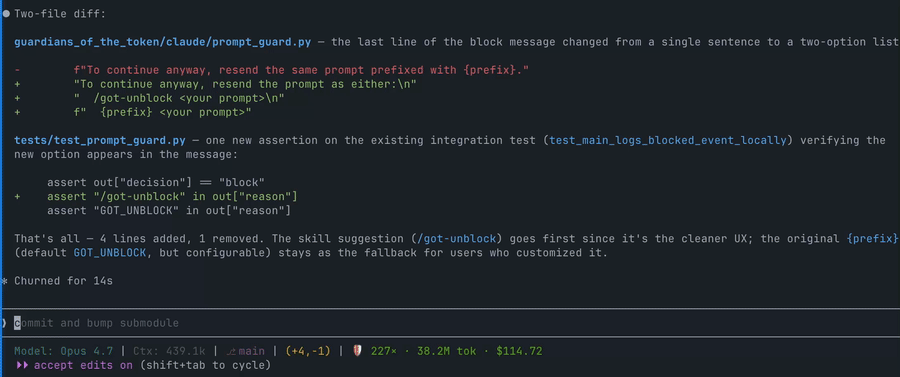

# GOT

[](https://pypi.org/project/guardians-of-the-token/)
[](https://pypistats.org/packages/guardians-of-the-token)
[](https://pypi.org/project/guardians-of-the-token/)
[](LICENSE)
[](https://github.com/tonylee2016/guardians_of_the_token/stargazers)
[](https://github.com/tonylee2016/guardians_of_the_token/actions/workflows/ci.yml)


**Guardians of the Token** keeps agentic coding sessions from wasting context.
It runs locally and watches the moves that quietly blow up your context window —
reading a huge file, fetching a big page, dumping noisy command output, or
drifting off-topic in a long session — and pauses them before they cost you.



## Why GOT

One bad move can burn your whole context window:

- reading a giant log or transcript into chat
- dumping command output that should have gone to a file
- fetching a large page directly into the model
- sending an off-topic prompt into an already-huge session

GOT turns those into a clear pause instead of a silent loss:

```text
🛡️ Guardians of the Token blocked this command.
Target: /tmp/big.log
Estimate: ~200,000 tokens (50% of the 400,000-token window)
Next options:
- Inspect the beginning / end
- Search for a term
- Summarize a bounded section
- Bypass once for the full file
```

Everything runs locally with lightweight token estimates — no data leaves your
machine.

## Install

```bash
pip install guardians-of-the-token
guardians-install
```

`guardians-install` detects your local clients (Claude Code, Codex, Claude
Desktop) and lets you pick what to enable with a checkbox selector. Add `--yes`
to enable everything detected without prompting. If global installs are blocked,
use `pipx install guardians-of-the-token` first.

That's it — the guards are now active. The rest of this README is what they do
and how to tune them.

### Install as a Claude Code plugin

GOT is also packaged as a Claude Code plugin. The plugin bundles the hooks,
MCP server, and skills, and its `SessionStart` hook auto-installs the
`guardians-of-the-token` PyPI package on first run (falling back to a manual
`pip install` hint if your environment blocks automatic installs). Plugin
skills are namespaced under the plugin name:

- `/guardians-of-the-token:got-unblock <prompt>` — bypass the prompt guard for
  one prompt.
- `/guardians-of-the-token:got-resume` — resume from the saved project-state
  snapshot.

## What you get

| Client | What GOT guards |
| --- | --- |
| Claude Code | `Read`, `Bash`, `WebFetch`, oversized output, off-topic prompts, and cold-start continuity |
| Codex | risky `Bash` file dumps, URL fetches, oversized output |
| Claude Desktop / MCP | bounded file tools via `guardians-mcp` (see [Advanced](#advanced)) |

### 1. Context guard

Before a risky `Read`, `Bash`, or `WebFetch` runs, GOT estimates its token cost
from file size, URL metadata, or command shape. If it's too large it blocks the
call and suggests bounded alternatives (inspect, search, summarize). Oversized
command output is trimmed before it reaches the model.

Need the full payload anyway? Bypass once:

```bash
touch /tmp/guardians_bypass
```

### 2. Prompt guard (Claude Code)

Once a session passes ~30% of the context window, GOT checks each new prompt for
topic drift. If a prompt looks unrelated to what you've been doing, it's blocked
*before* Claude reads it — saving a full round-trip of input tokens.

```text
🛡️ Guardians blocked this prompt before Claude processed it.

Reason: this looks unrelated to the current large Claude session.
Similarity: 0.07 (block threshold 0.10)
Context: 168.9k / 200.0k tokens (84%)
Estimated cost if sent: $0.5068

To continue anyway, resend the prompt prefixed with GOT_UNBLOCK.
```

To send it anyway, resend prefixed with `GOT_UNBLOCK` (or run `/got-unblock`).
A small ONNX model (~22 MB) is fetched automatically on install; re-fetch it
anytime with `guardians-download-models`.

### 3. Cold-start resume (Claude Code)

Long sessions eventually compact, and the next session starts cold. As a session
approaches its limit, GOT saves a snapshot of what you were doing to
`.got/project_state.md` — the latest summary, your recent goals, files touched,
and recent commands — built entirely from the local transcript.

On your next cold start in that project, GOT tells you a snapshot exists and asks
if you want to resume. To load it:

```text
/got-resume
```

Claude reads the snapshot and picks up where you left off. Nothing is injected
unless you ask.

## Configuration

User config lives at `~/.guardians.json`; per-project overrides go in
`.guardians.toml`. Common knobs:

```json
{
  "warn_threshold_pct": 20,
  "max_output_tokens": 8000,
  "telemetry_enabled": false,
  "prompt_guard": {
    "enabled": true,
    "block_context_pct": 0.30,
    "very_low_similarity": 0.10,
    "unblock_prefix": "GOT_UNBLOCK"
  },
  "project_state": {
    "enabled": true,
    "save_context_pct": 0.70,
    "max_age_hours": 168
  }
}
```

Set any feature's `"enabled": false` to turn it off. In `.guardians.toml` you can
also whitelist known-safe paths so agents never get blocked on them:

```toml
whitelist = ["README.md", "docs/**"]
ignore = ["node_modules/**", ".git/**"]
```

## Reports

GOT logs every block, trim, and snapshot locally to `.got/events.jsonl`.

```bash
guardians-report      # text summary of tokens and dollars saved
guardians-dashboard   # local web dashboard at 127.0.0.1:8766
```

Telemetry is **off by default**. If you opt in, GOT sends a single anonymous
install event (install ID, version, Python version, OS) — never paths, prompts,
content, commands, or token counts. Toggle with `GUARDIANS_TELEMETRY=0|1`.

Keep GOT current:

```bash
guardians update          # update from PyPI
guardians update --check  # check only
```

## Advanced

These surfaces are optional and aimed at non-hook workflows:

- **`guardians-mcp`** — MCP server giving Claude Desktop projects bounded file
  tools (`got_file_size`, `got_file_head`, `got_file_search`, …) and a preflight
  policy. Initialize a project with `guardians-project-init /path/to/project`.
- **`guardians-proxy`** — minimal FastAPI proxy that estimates request size for
  Anthropic/OpenAI-style payloads before forwarding (experimental).
- **`guardians-test-server`** — local fixture server for testing URL guards
  without downloading large payloads.

Manual / scoped installs are also available, e.g.
`guardians-claude-install /path/to/workspace` or `--global`, and the same for
`guardians-codex-install`.

---

GOT is early, practical infrastructure for local LLM workflows, focused on
preventing accidental context loss in Claude Code and Codex.
